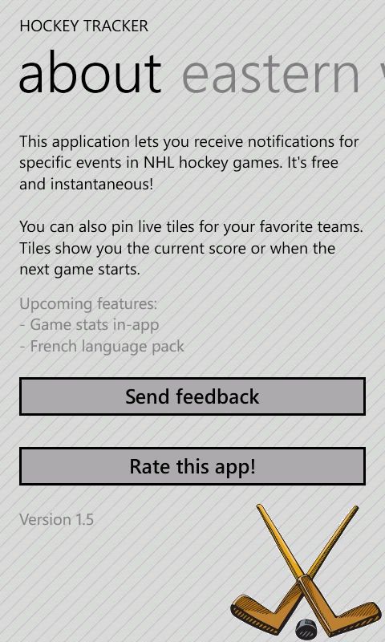
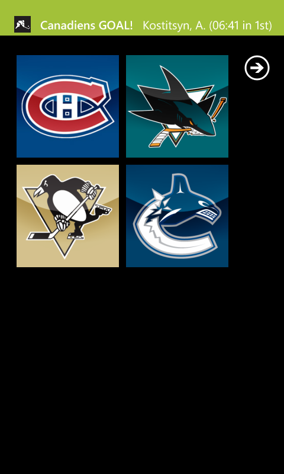

# Hockey Tracker

Hockey Tracker was the first Windows Phone app notifying users of NHL events in real time. Hockey fans could subscribe to goal and final score notifications, as well as receive Live Tile updates.

The app was released in 2011 and worked up until the end of the 2014-2015 season.

     

## Components

##### Phone app
* Enables users to subscribe to push notifications channels
* Handles push notification messages (show toast, update live tile)

##### Cloud app
* Manages user - channel push subscriptions
* Sends notifications
* Misc. admin tools

##### Parser
* Periodically scrapes source for new games to follow and game updates, stores data
* Tells cloud app to send notifications

## Testimonials

> It is awesome because if you can't watch the game. It tells you every goal that is scored. And I think that there should be one for every sport. So if you could do that that would be awesome. So if you could do it quick that I'll be good.
>
> David

> This app is awesome thanks!
> 
> MacKenzie

> I love this app. Thanks
>
> Leon